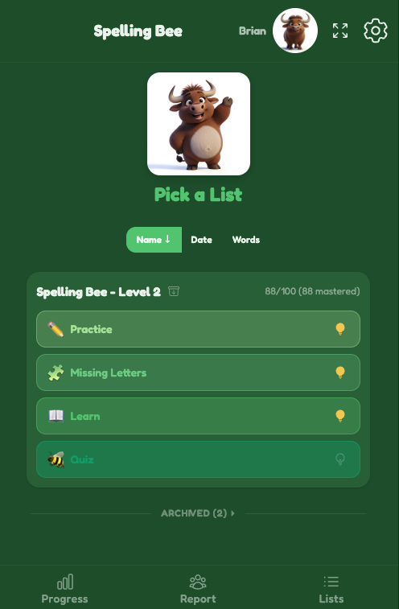
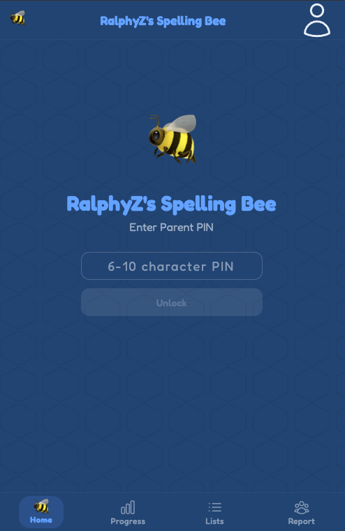
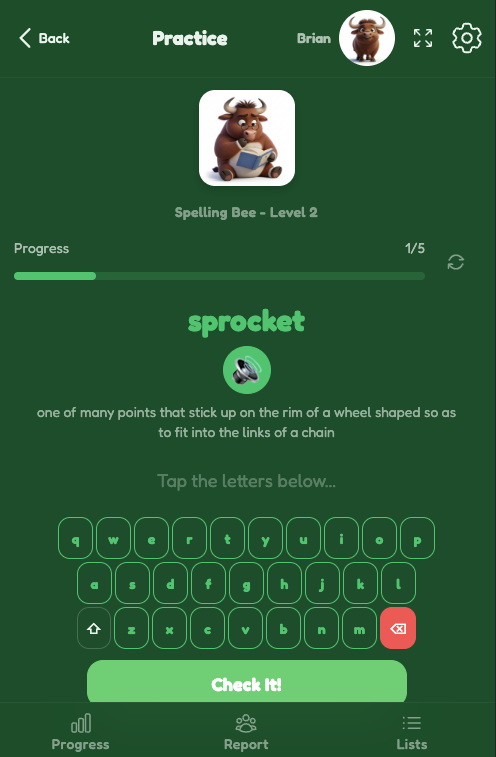
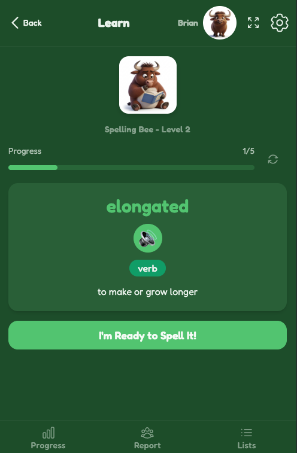
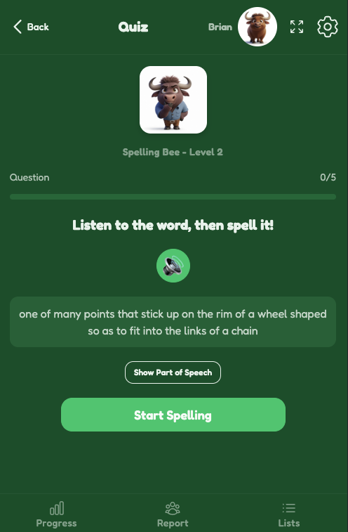
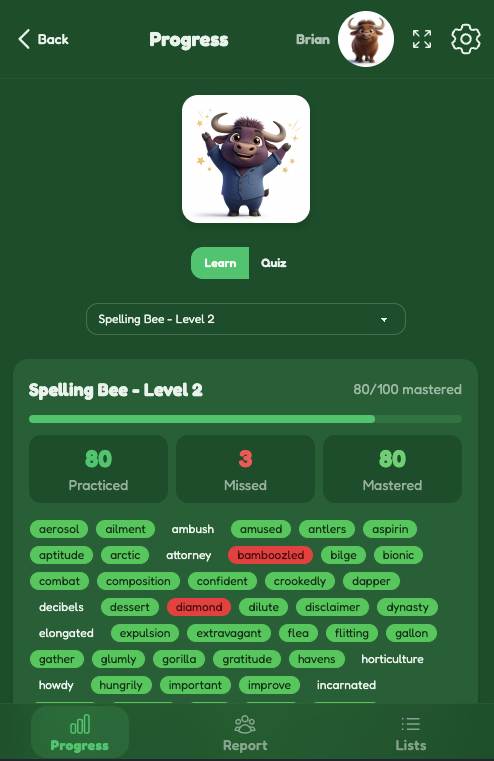
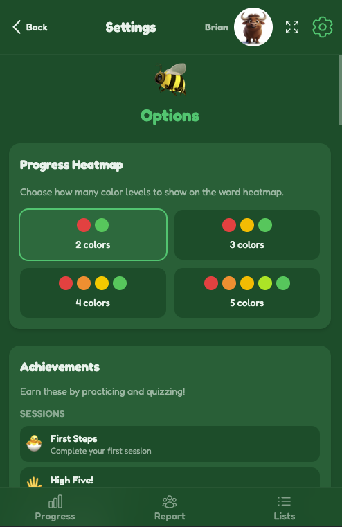
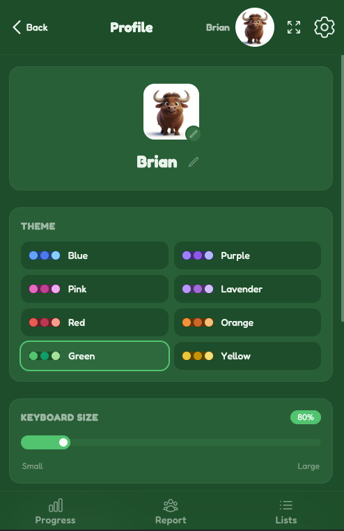
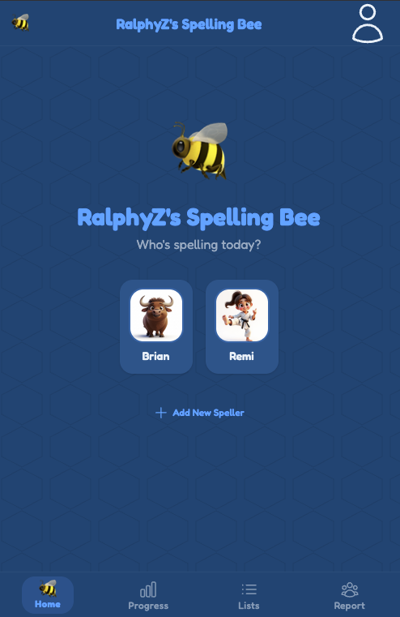
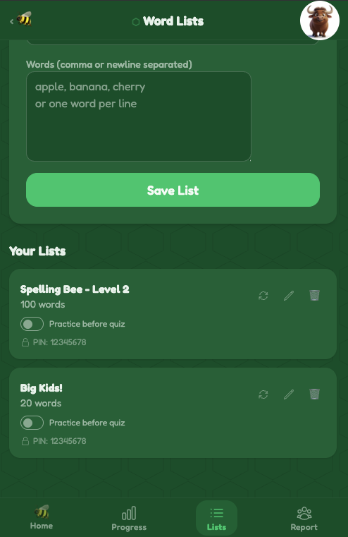

# RalphyZ's Spelling Bee

A kid-friendly spelling practice app built for daily spelling homework and test prep. Supports multiple users, word lists, dictionary lookups with audio pronunciations, and a variety of study modes.

Built with React 19, TypeScript, Vite 7, TailwindCSS 4, DaisyUI 5, and Bun.



## Features

### Study Modes

- **Practice** -- Type each word after hearing it spoken aloud. Words are selected using a spaced repetition algorithm that prioritizes words you've gotten wrong.
- **Learn** -- Study a word (see it spelled, hear it, read the definition), then practice typing it. Get immediate feedback and retry if needed.
- **Quiz** -- Hear the word, spell it from memory, and submit. Results are tracked toward mastery. Words must be practiced before they can be quizzed.
- **Missing Letters** -- Fill in the blanks. The app hides ~45% of each word's letters and you type the missing ones.

### Highlight Mode

Each activity has an optional highlight toggle (lightbulb icon) that shows real-time green/red letter feedback as you type. When enabled on Quiz, results count as practice instead -- a warning dialog explains this before you start.

### PIN-Based Access Control

The app uses a simple PIN system to separate families or classrooms sharing the same server.

- **Parent/Admin PIN** -- Set via the `ADMIN_PIN` environment variable (default: `123456`). The admin PIN grants access to all user profiles and all word lists. Admin login is restricted to the server's local network (/16 subnet).
- **User PINs** -- Each user profile can be assigned a PIN (6-10 alphanumeric characters). Logging in with a user PIN shows only the profiles and word lists associated with that PIN.
- **Admin capabilities** -- Set or reset PINs on any user profile, change the admin PIN at runtime, assign or change the PIN on any word list, invalidate all active sessions.
- **Session persistence** -- Auth sessions persist for 48 hours in the browser, surviving refreshes and tab closes. The 48-hour window resets on every app load. Admins can force-logout all users with the "Invalidate All Sessions" button.
- **Rate limiting** -- Wrong PINs trigger a 3-second cooldown. After 3 failures from the same IP, a 10-minute block. After 5 global failures within 1 minute, all non-local IPs are blocked for 10 minutes.
- **Runtime PIN changes** -- The admin can change their own PIN from the login screen. The new PIN is persisted in `admin-pin.json` (gitignored).

> **Note:** This is not a security system. PINs are transmitted in plain text and stored without hashing. It is designed to keep kids in their own profiles, not to protect sensitive data.



### Multi-User Support

- Multiple user profiles with individual settings, progress, and session history
- Per-user word count preferences for each activity
- Per-user keyboard size, theme selection, and highlight preferences

### Progress Tracking

- Color-coded heatmap showing word mastery across all lists
- Session history with detailed results
- Configurable mastery levels (2-5 color grades)
- Achievement system with 50+ achievements across 10 categories
- Mischievements for fun milestones (typos, highlight usage, etc.)

### Dictionary Integration

- Merriam-Webster Dictionary API with 4 dictionary levels:
  - Elementary (Grades 3-5)
  - Intermediate (Grades 6-8)
  - Collegiate
  - Learner's
- Audio pronunciations for every word
- Definitions displayed during Learn mode

### ElevenLabs Text-to-Speech (Optional)

- High-quality AI voice for word pronunciation and letter-by-letter spelling
- Pre-generated static letter audio files (A-Z + "capital") included in the project -- no API calls needed for letters
- Word audio is fetched from ElevenLabs once per unique word and cached permanently on disk (`tts-cache/`)
- Falls back to Merriam-Webster audio and browser speech synthesis if ElevenLabs is not configured
- Server-side proxy keeps the API key secret -- never exposed to the browser

### Default Word List

- Ships with a "Big Kids!" starter list (20 simple words: cat, dog, sun, etc.) so new users have something to practice right away
- Includes Merriam-Webster definitions for each word
- Automatically loaded on first server start when no existing data is found

### Additional Features

- 8 custom color themes
- Adjustable on-screen keyboard size
- Text-to-speech fallback when dictionary audio is unavailable
- PWA-ready for mobile home screen installation
- List archiving to keep the home page tidy
- Sortable word lists (by name, date, or word count)
- Parent/teacher page for managing word lists (PIN-scoped)
- Report page for reviewing progress across all users (filtered by PIN)
- Word lists can be assigned to a PIN so each family/group sees only their lists
- Animated bee mascot with different poses per page

## Screenshots

| Home | Practice | Learn |
|------|----------|-------|
|  |  |  |

| Quiz | Missing Letters | Progress |
|------|-----------------|----------|
|  |  |  |

| Options | User Profile |
|---------|--------------|
|  |  |

| PIN Login | User Selection | Word List Management |
|-----------|----------------|----------------------|
|  |  |  |

## Prerequisites

- [Bun](https://bun.sh) (runtime and package manager)
- [Merriam-Webster API keys](https://dictionaryapi.com/register/index) (free for non-commercial use)
- [ElevenLabs API key](https://elevenlabs.io) (optional -- adds high-quality AI voice for word and letter pronunciation; requires paid plan)

## Installation

### macOS

1. **Install Bun**

   ```bash
   curl -fsSL https://bun.sh/install | bash
   ```

2. **Clone the repository**

   ```bash
   git clone <your-repo-url>
   cd spelling-bee
   ```

3. **Install dependencies**

   ```bash
   bun install
   ```

4. **Set up environment variables**

   ```bash
   cp .env.example .env
   ```

   Edit `.env` and replace the placeholder values with your Merriam-Webster API keys and set your admin PIN. Register for free keys at [dictionaryapi.com](https://dictionaryapi.com/register/index). You'll need to request keys for each dictionary you want to use:

   - Elementary Dictionary (Grades 3-5)
   - Intermediate Dictionary (Grades 6-8)
   - Collegiate Dictionary
   - Learner's Dictionary

   Also set `ADMIN_PIN` to a 6-10 character alphanumeric PIN for parent/admin access (default: `123456`).

   **Optional:** To enable ElevenLabs TTS, add your API key and voice ID:

   ```
   ELEVENLABS_API_KEY=your-elevenlabs-api-key-here
   ELEVENLABS_VOICE_ID=your-elevenlabs-voice-id-here
   ```

   Sign up at [elevenlabs.io](https://elevenlabs.io) (requires a paid plan for API access to premade voices). If not configured, the app falls back to Merriam-Webster audio and browser speech synthesis.

5. **Start the API server**

   ```bash
   bun run server
   ```

   This starts the backend API on port 3001. It stores word lists in `data.json`, session records in `sessions.json`, and the runtime admin PIN in `admin-pin.json`. All three are gitignored.

6. **Start the dev server** (in a separate terminal)

   ```bash
   bun run dev
   ```

   The app will be available at `http://localhost:5173`. The Vite dev server proxies `/api` requests to the backend on port 3001.

### Windows (untested)

> **Note:** These instructions have not been tested on Windows. If you encounter issues, please open an issue.

1. **Install Bun**

   Open PowerShell and run:

   ```powershell
   irm bun.sh/install.ps1 | iex
   ```

   Alternatively, install via [Scoop](https://scoop.sh):

   ```powershell
   scoop install bun
   ```

2. **Clone the repository**

   ```powershell
   git clone <your-repo-url>
   cd spelling-bee
   ```

3. **Install dependencies**

   ```powershell
   bun install
   ```

4. **Set up environment variables**

   ```powershell
   copy .env.example .env
   ```

   Edit `.env` with your Merriam-Webster API keys. See the macOS step 4 above for details on obtaining keys.

5. **Start the API server**

   ```powershell
   bun run server
   ```

6. **Start the dev server** (in a separate terminal)

   ```powershell
   bun run dev
   ```

   The app will be available at `http://localhost:5173`.

## Building for Production

```bash
bun run build
```

The built files will be in the `dist/` directory. Serve them with any static file server, and run the API server alongside it.

## Project Structure

```
spelling-bee/
  server.ts              # Bun API server (port 3001) — includes auth and TTS proxy endpoints
  data.json              # Word lists and user profiles (gitignored)
  sessions.json          # Session history (gitignored)
  admin-pin.json         # Runtime admin PIN (gitignored)
  tts-cache/             # Cached ElevenLabs word audio MP3s (gitignored)
  src/
    App.tsx              # Routes and app shell
    context/AppContext.tsx  # Global state (React Context + useReducer)
    pages/               # Page components (Home, Practice, Learn, Quiz, etc.)
    components/          # UI components organized by feature
      layout/            # AppShell, BottomNav, UserGate (PIN login)
      shared/            # LetterTileRow, Keyboard, PageAvatar, etc.
      learn/             # Learn mode components
      practice/          # Practice mode components
      quiz/              # Quiz mode components
      missingLetters/    # Missing Letters mode components
      parent/            # Word list management components
    hooks/               # Custom hooks (session management, dictionary, speech, etc.)
    config/              # Dictionary API configuration
    types/               # TypeScript type definitions
    utils/               # Achievements, mischievements, spaced repetition
  public/
    audio/letters/       # Pre-generated ElevenLabs letter audio (a-z + capital)
    manifest.json        # PWA manifest
```

## Tech Stack

| Layer | Technology |
|-------|-----------|
| Runtime | [Bun](https://bun.sh) |
| Frontend | [React 19](https://react.dev) |
| Language | [TypeScript 5.9](https://www.typescriptlang.org) |
| Build | [Vite 7](https://vite.dev) |
| Styling | [TailwindCSS 4](https://tailwindcss.com) + [DaisyUI 5](https://daisyui.com) |
| Animation | [Motion](https://motion.dev) (Framer Motion) |
| Routing | [React Router 7](https://reactrouter.com) |
| Dictionary | [Merriam-Webster API](https://dictionaryapi.com) |
| TTS | [ElevenLabs](https://elevenlabs.io) (optional) |
| Data | JSON file storage via Bun server |

## License

This project is licensed under the [MIT License](LICENSE).
